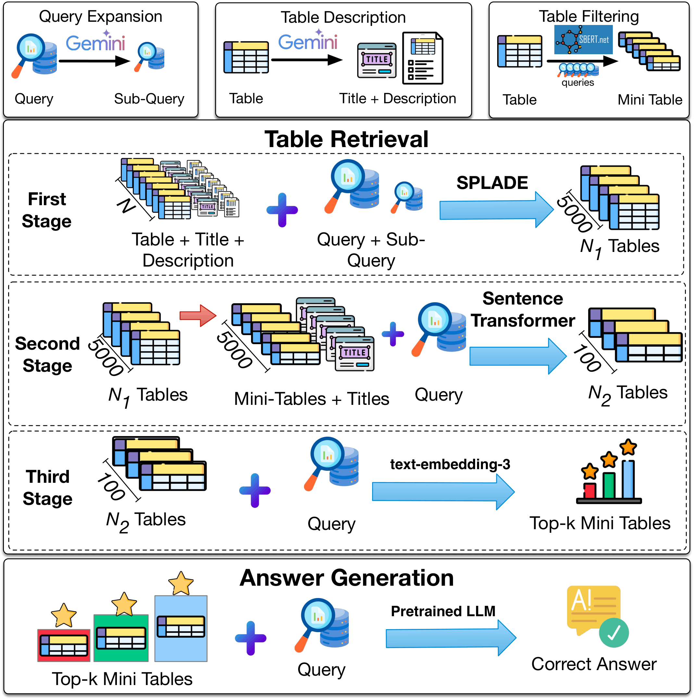

# CRAFT: Training-Free Cascaded Retrieval for Tabular QA

[](https://aclanthology.org/2025.acl-long.0)
[](https://opensource.org/licenses/MIT)
[](https://www.python.org/downloads/)
[](https://github.com/google-research/tapas)
[](https://github.com/wenhuchen/OTT-QA)

**(ACL 2026)** CRAFT is a training-free, three-stage cascaded retrieval framework for open-domain table question answering over Tables. It achieves state-of-the-art retrieval on NQ-Tables and strong zero-shot generalisation on OTT-QA dataset with no dataset-specific fine-tuning.


<!-- Figure 1 from the paper. See static/images/README.md if the image is missing. -->


**Stage 1 — SPLADE** sparse retrieval: full corpus → 5,000 candidates  
**Stage 2 — Dense reranking** (Sentence Transformers / JINA): 5,000 → 100  
**Stage 3 — Neural reranking** (OpenAI / Gemini embeddings): 100 → top-k  
---

## Installation

```bash
git clone .
cd CRAFT
pip install -e .
pip install -r requirements.txt
cp .env.example .env   # fill in API keys
```


**Data** - Pre-computed stage results and supporting data files are available on [Google Drive](https://drive.google.com/drive/u/0/folders/1liOW5iwZLbzvSxZJTPbqnLJ3CEsakN_C). Download and place the files under `datasets/` before running the pipeline.

Original source datasets: [NQ-Tables](https://github.com/google-research/tapas) · [OTT-QA](https://github.com/wenhuchen/OTT-QA)

---

## Running the Pipeline

### Command-line

```bash
# Full NQ-Tables pipeline (all 3 stages)
python run_nq.py --stage all

# Full OTT-QA pipeline
python run_ottqa.py --stage all

# Individual stages
python run_nq.py --stage 1
python run_nq.py --stage 2 --stage1-path results/stage1/nq_splade_5000.txt
python run_nq.py --stage 3 --stage2-path results/stage2/nq_dense_100.pkl
```

### Notebooks (interactive)

```bash
jupyter notebook scripts/stage1_splade_retrieval.ipynb   # Stage 1
jupyter notebook scripts/stage2_dense_reranking.ipynb    # Stage 2  (set DATASET="nq"|"ottqa")
jupyter notebook scripts/stage3_neural_reranking.ipynb   # Stage 3
```

---

## End-to-End QA

Uses the top-k mini-tables from Stage 3 as context for an LLM to generate answers.

### Small models (7–8B)

```bash
# Mistral-7B-Instruct
python scripts/qa_evaluation.py \
  --metadata datasets/nq_tables_metadata_updated.csv \
  --questions datasets/combined.jsonl \
  --corpus datasets/nq_stage3_results.jsonl \
  --top-rows datasets/nq_stage2_results.pkl \
  --row-data datasets/nq_row_tables.json \
  --model mistralai/Mistral-7B-Instruct-v0.2 \
  --tables 1 3 5 --mini-table --output results/qa_mistral7b.jsonl

# Llama-3-8B-Instruct
python scripts/qa_evaluation.py \
  --metadata datasets/nq_tables_metadata_updated.csv \
  --questions datasets/combined.jsonl \
  --corpus datasets/nq_stage3_results.jsonl \
  --top-rows datasets/nq_stage2_results.pkl \
  --row-data datasets/nq_row_tables.json \
  --model meta-llama/Meta-Llama-3-8B-Instruct \
  --tables 1 3 5 --mini-table --output results/qa_llama3_8b.jsonl

# Qwen2.5-7B-Instruct
python scripts/qa_evaluation.py \
  --metadata datasets/nq_tables_metadata_updated.csv \
  --questions datasets/combined.jsonl \
  --corpus datasets/nq_stage3_results.jsonl \
  --top-rows datasets/nq_stage2_results.pkl \
  --row-data datasets/nq_row_tables.json \
  --model Qwen/Qwen2.5-7B-Instruct \
  --tables 1 3 5 --mini-table --output results/qa_qwen25_7b.jsonl
```

### Large models (70B+)

```bash
# Llama-3.1-70B-Instruct
python scripts/qa_evaluation.py \
  --model meta-llama/Llama-3.1-70B-Instruct \
  --tables 1 5 --mini-table --output results/qa_llama31_70b.jsonl \
  [... same data paths as above ...]

# Llama-3.3-70B-Instruct
python scripts/qa_evaluation.py \
  --model meta-llama/Llama-3.3-70B-Instruct \
  --tables 1 5 --mini-table --output results/qa_llama33_70b.jsonl \
  [... same data paths as above ...]

# Qwen2.5-72B-Instruct
python scripts/qa_evaluation.py \
  --model Qwen/Qwen2.5-72B-Instruct \
  --tables 1 5 --mini-table --output results/qa_qwen25_72b.jsonl \
  [... same data paths as above ...]

# Mistral-Small-Instruct
python scripts/qa_evaluation.py \
  --model mistralai/Mistral-Small-Instruct-2409 \
  --tables 1 5 --mini-table --output results/qa_mistral_small.jsonl \
  [... same data paths as above ...]

# GPT-4o  (requires OPENAI_API_KEY)
python scripts/qa_evaluation.py \
  --model gpt-4o \
  --tables 1 5 --mini-table --output results/qa_gpt4o.jsonl \
  [... same data paths as above ...]
```

> Use `--tables 1 3 5 8 10` to reproduce the full sweep from Table 5/6 in the paper.  
> Use `--max-queries 100` for a quick sanity-check run.  
> OTT-QA: replace `--corpus` and `--top-rows` paths with the OTT-QA stage 3 results.

---

## Results

### NQ-Tables Retrieval
| Method | Type | R@1 | R@10 | R@50 |
|--------|------|-----|------|------|
| BM25 | Sparse | 18.49 | 36.94 | 52.61 |
| SPLADE | Sparse | 39.84 | 83.33 | 94.65 |
| BIBERT | Dense | 43.78 | 82.25 | 93.71 |
| DPR | Dense | 45.32 | 85.84 | 95.44 |
| TAPAS | Dense | 43.79 | 83.49 | 95.10 |
| DTR (M) + HN | Dense | 47.33 | 80.96 | 91.51 |
| SSDR(im) | Dense | 45.47 | 84.00 | 95.05 |
| T-RAG | Dense | 46.07 | 85.40 | 95.03 |
| BIBERT+SPLADE | Hybrid | 45.62 | 86.72 | 95.62 |
| THYME | Hybrid | 48.55 | 86.38 | 96.08 |
| **CRAFT** | **Training-Free** | **49.84** | **86.83** | **97.17** |

### OTT-QA Retrieval
| Method | Type | R@1 | R@10 | R@50 |
|--------|------|-----|------|------|
| SPLADE (supervised) | Sparse | 62.74 | 89.52 | 95.21 |
| BIBERT+SPLADE | Hybrid | 64.72 | 91.01 | 96.34 |
| THYME | Hybrid | 66.67 | 91.10 | 96.16 |
| **CRAFT** | **Training-Free** | **55.56** | **89.88** | **96.07** |

### End-to-End QA on NQ-Tables (F1)
| Model | n=1 | n=5 |
|-------|-----|-----|
| LI-RAGE (SOTA, trained) | — | 54.17 |
| CRAFT + Llama-3.1-70B | 49.75 | 56.94 |
| CRAFT + Mistral-Small | 50.26 | 57.14 |
| CRAFT + GPT-4o | **56.76** | **67.72** |

---

**Required Keys** ():
```
OPENAI_API_KEY   – Stage 3 on NQ-Tables
GEMINI_API_KEY   – Stage 3 on OTT-QA + preprocessing
```

## Citation

```bibtex
@misc{singh2025crafttrainingfreecascadedretrieval,
      title={CRAFT: Training-Free Cascaded Retrieval for Tabular QA}, 
      author={Adarsh Singh and Kushal Raj Bhandari and Jianxi Gao and Soham Dan and Vivek Gupta},
      year={2025},
      eprint={2505.14984},
      archivePrefix={arXiv},
      primaryClass={cs.CL},
      url={https://arxiv.org/abs/2505.14984}, 
}
```

## License

MIT - see [LICENSE](LICENSE).
