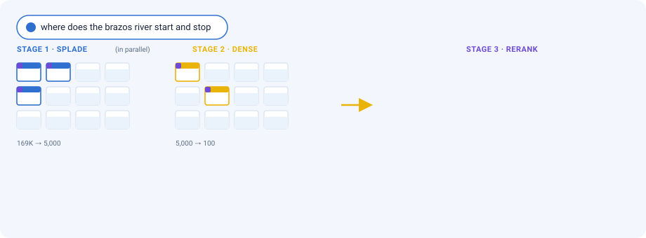

<div align="center">

# CRAFT

### Training-Free Cascaded Retrieval for Tabular QA

[](https://aclanthology.org/2026.acl-long.149/)
[](https://arxiv.org/abs/2505.14984)
[](https://pypi.org/project/craft-tabqa/)
[](LICENSE)
[](https://www.python.org/downloads/)

**Find the tables that answer a question — from a corpus of hundreds of thousands, with no fine-tuning.**



</div>

---

## What CRAFT is

Given a large collection of tables and a natural-language question, **CRAFT returns a short, ranked
list of the tables most likely to answer it** — which you can read directly, or pass to a language
model to generate an answer.

CRAFT is **training-free**. It composes off-the-shelf retrieval models into a cascade, so there is no
model to fine-tune and nothing dataset-specific to label. Pointing it at a new collection of tables is
a matter of writing a config.

## How it works

CRAFT narrows the corpus in three stages, each more precise (and more expensive) than the last, but
running on a progressively smaller set of candidates.

| Stage | What it does | Narrows |
|-------|--------------|---------|
| **1 · Sparse** | SPLADE scores every table by lexical overlap with the query — a fast, wide net that protects recall. | corpus → ~5,000 |
| **2 · Dense** | A sentence encoder reranks candidates by meaning, using the most query-relevant rows of each table. | ~5,000 → ~100 |
| **3 · Rerank** | A reranker or embedding model — open-source or API — produces the final ordering. This stage is swappable. | ~100 → top-*k* |

An optional **enrichment** step can first generate a title and description for each table (and expand
queries into sub-questions) with a small open-source model, which helps the lexical and dense stages
match tables that have sparse or missing metadata.

## Install

```bash
pip install craft-tabqa                 # core (Stages 1 & 2)
pip install "craft-tabqa[openai]"       # + Stage 3 with OpenAI embeddings
pip install "craft-tabqa[gemini]"       # + Stage 3 with Gemini embeddings
pip install "craft-tabqa[vllm]"         # + LLM enrichment served via vLLM
pip install "craft-tabqa[serve]"        # + local retrieval API
pip install "craft-tabqa[tui]"          # + interactive terminal app
pip install "craft-tabqa[all]"          # everything except vllm
```

From source:

```bash
git clone https://github.com/coral-lab-asu/CRAFT.git
cd CRAFT
pip install -e ".[dev]"
```

API keys and hardware settings are read from a `.env` file (see `.env.example`):

```ini
CUDA_VISIBLE_DEVICES=0,1
HF_HOME=/path/to/hf_cache
HF_TOKEN=hf_...          # gated models (e.g. JINA v3)
OPENAI_API_KEY=sk-...    # enables Stage 3 (OpenAI)
GEMINI_API_KEY=...       # enables Stage 3 (Gemini)
```

## Quickstart

Every command reads one YAML config and shares a single cache directory
(`<output_dir>/cache`), so preprocessing runs once and retrieval reuses it.

```bash
# 1. Build the SPLADE index and row embeddings for your corpus (run once)
craft preprocess --config configs/nq_tables.yaml

# 2. Retrieve the most relevant tables for each query
craft retrieve   --config configs/nq_tables.yaml

# 3. (optional) Explore results interactively
craft serve      --config configs/nq_tables.yaml   # local API at http://localhost:8000
craft tui                                           # menu-driven terminal app
```

Retrieval writes one JSONL of ranked tables per stage into a fresh, timestamped run directory, along
with a recall summary.

Handy flags:

```bash
craft preprocess --config <cfg> --rebuild-index   # rebuild just the SPLADE index
craft retrieve   --config <cfg> --skip-stage1     # reuse saved Stage 1 results
craft retrieve   --config <cfg> --no-stage3       # skip Stage 3 even if a key is set
```

## Optional: enrich tables and queries

Set `generation.enabled: true` in your config to generate a title and description for every table
(and, with `expand_queries: true`, a sub-question and description for every query) before indexing.
The prompts live in [`src/craft_tabqa/prompts/`](src/craft_tabqa/prompts) and are plain text you can edit.

```bash
craft generate --config configs/nq_tables.yaml   # enrichment only
```

Backends: `vllm` (default; batched local generation, best at corpus scale), `transformers`, or
`openai`. Generated fields are cached, so the step is resumable.

## Use your own data

Copy [`configs/custom_template.yaml`](configs/custom_template.yaml) and point it at two JSONL files.

**`corpus.jsonl`** — one table per line:

```json
{"table_id": "solar_0", "title": "Planets", "headers": ["Planet", "Moons"],
 "rows": [["Mercury", "0"], ["Saturn", "146"]], "description": "optional"}
```

**`queries.jsonl`** — one question per line:

```json
{"qid": "q1", "question": "Which planet has the most moons?",
 "gold_table_ids": ["solar_0"], "subquestion": "optional", "answer": "optional"}
```

`gold_table_ids` is only used to compute recall — omit it if you have no ground truth. All models,
top-*k* values, batch sizes, and the Stage 2 mode are set in the config, with each field commented inline.

## Datasets

CRAFT ships with configs for two open-domain table-QA benchmarks:

- **NQ-Tables** — [TAPAS release](https://github.com/google-research/tapas/blob/master/DENSE_TABLE_RETRIEVER.md); place `tables.jsonl` and `combined.jsonl` under `datasets/NQ_Tables/`.
- **OTT-QA** — [OTT-QA repo](https://github.com/wenhuchen/OTT-QA#step1-1-download-the-necessary-files); place `all_plain_tables.json` and `released_data/dev.json` under `datasets/OTT-QA/`.

See the config files for the exact paths CRAFT expects.

## Package layout

```
src/craft_tabqa/
├── config.py            typed YAML config
├── cli.py               the `craft` command
├── core/                text builders, SPLADE, dense encoding, metrics, file I/O
├── loaders/             NQ-Tables / OTT-QA / generic JSONL loaders
├── preprocessing/       enrichment, SPLADE index, row encoder, orchestrator
├── retrieval/           stage 1/2/3 + orchestrator + recall reporting
├── serve/               local retrieval API + engine
└── prompts/             editable enrichment prompt templates
```

## Citation

```bibtex
@inproceedings{singh2026craft,
  title     = {CRAFT: Training-Free Cascaded Retrieval for Tabular QA},
  author    = {Singh, Adarsh and Bhandari, Kushal Raj and Gao, Jianxi and Dan, Soham and Gupta, Vivek},
  booktitle = {Proceedings of the 64th Annual Meeting of the Association for Computational Linguistics},
  year      = {2026},
  url       = {https://aclanthology.org/2026.acl-long.149/},
}
```

## License

MIT — see [LICENSE](LICENSE).
