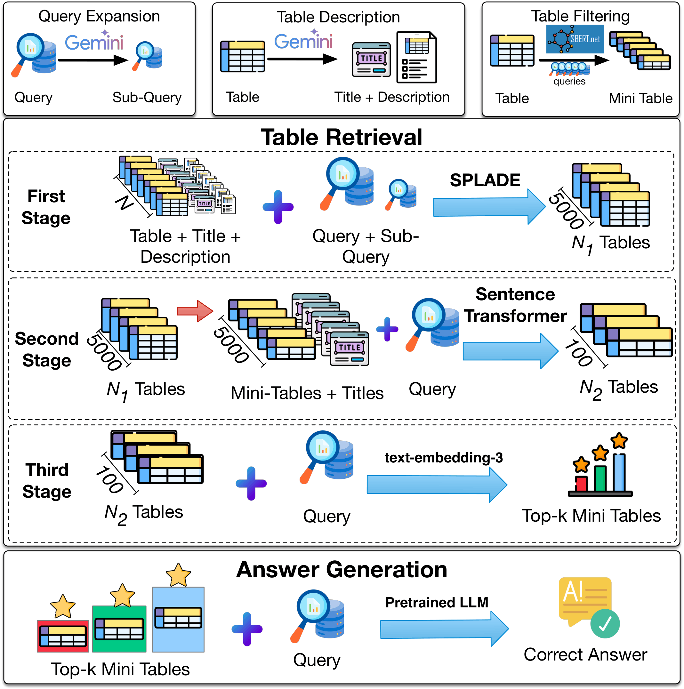

# CRAFT: Training-Free Cascaded Retrieval for Tabular QA

[](https://arxiv.org/abs/2505.14984)
[](https://opensource.org/licenses/MIT)
[](https://www.python.org/downloads/)
[](https://github.com/google-research/tapas)
[](https://github.com/wenhuchen/OTT-QA)

CRAFT is a **training-free**, three-stage cascaded retrieval framework for open-domain table question answering. It achieves state-of-the-art retrieval on NQ-Tables and strong zero-shot generalisation on OTT-QA, with **no dataset-specific fine-tuning**.



| Stage | Model | Input → Output |
|-------|-------|----------------|
| **Stage 1** | SPLADE (sparse) | Full corpus → top-5,000 |
| **Stage 2** | Sentence Transformer (dense) | 5,000 → top-100 via mini-tables |
| **Stage 3** | OpenAI / Gemini embeddings | 100 → top-k *(optional)* |

---

## Table of Contents

1. [Installation](#installation)
2. [Data Setup](#data-setup)
   - [NQ-Tables](#nq-tables)
   - [OTT-QA](#ott-qa)
   - [Folder structure](#folder-structure)
3. [Running the Pipeline](#running-the-pipeline)
4. [Input Format (custom datasets)](#input-format-custom-datasets)
5. [Citation](#citation)


## Installation

```bash
git clone https://github.com/corallab-asu/CRAFT.git
cd CRAFT
pip install -e .
pip install -r requirements.txt
```


```ini
# .env
CUDA_VISIBLE_DEVICES=0     # GPUs to use (comma-separated indices)
HF_HOME=/path/to/hf_cache      # HuggingFace model cache directory
HF_TOKEN=hf_...                 # Required for gated models (JINA v3 on OTT-QA)
OPENAI_API_KEY=sk-...           # Stage 3 on NQ-Tables (optional)
GEMINI_API_KEY=...              # Stage 3 on OTT-QA (optional)
```

Stage 3 is **automatically skipped** when no API key is present.

---

## Data Setup

### NQ-Tables

**Source:** [Google Research / TAPAS — NQ-Tables Dataset](https://github.com/google-research/tapas/blob/master/DENSE_TABLE_RETRIEVER.md#load-directly-the-released-data)

Download the NQ-Tables corpus and interactions and place them as follows:

```
datasets/NQ_Tables/
├── tables/
│   └── tables.jsonl          ← one table per line (169,898 tables, ~1 GB)
└── interactions/
    └── combined.jsonl        ← one query per line (966 test questions)
```

**What the raw files look like:**

`tables/tables.jsonl` — one JSON object per line:
```json
{
  "tableId":       "Lesley_Joseph_A1D55A57",
  "documentTitle": "Lesley Joseph",
  "columns":       [{"text": "Born"}, {"text": "Nationality"}, ...],
  "rows":          [{"cells": [{"text": "1939"}, {"text": "British"}, ...]}]
}
```

`interactions/combined.jsonl` — one JSON object per line:
```json
{
  "qid":                       "dev_6330519627947400943_0",
  "OriginalQuestion":          "where does the brazos river start and stop",
  "GeneratedSubQuestion":      "What are the source and mouth locations of the Brazos River?",
  "GeneratedQuestionDescription": "The user wants to know ...",
  "gold_table_id":             "Brazos_River_4C2A1B"
}
```

> **LLM-generated table descriptions (NQ-Tables only):** CRAFT uses an additional file `nq_table_summary_table_description.jsonl` (one description per table, ~180 MB) produced by prompting an LLM. Download it from [Google Drive](https://drive.google.com/drive/u/0/folders/1liOW5iwZLbzvSxZJTPbqnLJ3CEsakN_C) and place it at:
>
> ```
> datasets/nq_table_summary_table_description.jsonl
> ```
>
> Without this file, Stage 1 still runs but uses `title+headers+cells` only (lower retrieval performance).

---

### OTT-QA

**Source:** Follow [Step 1-1 in the OTT-QA repo](https://github.com/wenhuchen/OTT-QA#step1-1-download-the-necessary-files) to download the necessary files, then place them as follows:

```
datasets/OTT-QA/
├── all_plain_tables.json        ← all tables in one file (~380 MB)
└── released_data/
    └── dev.json                 ← dev questions (2,214 questions, ~3 MB)
```

**What the raw files look like:**

`all_plain_tables.json` — a single JSON dict mapping `uid → table`:
```json
{
  "Serbia_at_the_European_Athletics_Championships_2": {
    "uid":           "Serbia_at_the_European_Athletics_Championships_2",
    "title":         "Serbia at the European Athletics Championships",
    "intro":         "Serbia officially has competed since 2006 ...",
    "section_title": "Medal table",
    "section_text":  "The medals were awarded in ...",
    "header":        [["Medal", []], ["Name", ["/wiki/..."]], ["Event", []]],
    "data":          [[["Gold", []], ["Slobodan Branković", ["/wiki/..."]], ["400m", []]]]
  },
  ...
}
```

> `header` and `data` cells are `[text, [links]]` pairs — the pipeline extracts the text automatically.
> The `intro`, `section_title`, and `section_text` fields are all concatenated to form the table description used by Stage 1.

`released_data/dev.json` — a JSON array:
```json
[
  {
    "question_id": "2b6359edb1b352c3",
    "question":    "Who created the series in which the character of Robert appeared?",
    "table_id":    "Nonso_Anozie_1",
    "answer-text": "Lynda La Plante"
  }
]
```

---

### Folder structure

After data setup, your `datasets/` directory should look like this:

```
datasets/
├── NQ_Tables/
│   ├── tables/tables.jsonl
│   └── interactions/combined.jsonl
├── OTT-QA/
│   ├── all_plain_tables.json             ← all tables in one file
│   └── released_data/dev.json
└── nq_table_summary_table_description.jsonl   ← NQ-Tables only, from Drive
```

---

## Running the Pipeline

### Option 1 — One command (recommended)

Runs preprocessing and retrieval back-to-back with full logging and run isolation:

```bash
# NQ-Tables
python scripts/run_pipeline.py --config configs/nq_tables.yaml

# OTT-QA
python scripts/run_pipeline.py --config configs/ottqa.yaml
```

Results land in a timestamped directory under `results/<dataset>_pipeline/` with a `recall_summary.csv` and full log file.

### Option 2 — Two steps

**Step A — Preprocessing** *(run once per corpus, results are cached)*

```bash
python scripts/preprocess.py --config configs/nq_tables.yaml
```

Builds and caches to `results/nq_pipeline/cache/`:

| Artifact | Description |
|----------|-------------|
| `corpus_texts.pkl` | One text string per table (SPLADE input) |
| `splade_index.pkl` | SPLADE inverted index (~28k unique terms for NQ) |
| `row_texts.pkl` | One text string per table row |
| `row_meta.pkl` | Row → table mapping + text (used by Stage 2) |
| `row_embeddings.npy` | Dense vectors for every row (~1.8 M for NQ, float32) |

Preprocessing is **resumable** — re-running skips already-built artifacts. Force a rebuild:

```bash
python scripts/preprocess.py --config configs/nq_tables.yaml --rebuild-index  # redo SPLADE index
python scripts/preprocess.py --config configs/nq_tables.yaml --rebuild-rows   # redo row embeddings
```

**Step B — Retrieval** *(run per query set)*

```bash
python scripts/retrieve.py --config configs/nq_tables.yaml
```

Outputs:

| File | Description |
|------|-------------|
| `stage1_results.jsonl` | Top-5,000 tables per query (SPLADE) |
| `stage2_results.jsonl` | Top-100 tables per query (dense reranking) |
| `stage3_results.jsonl` | Top-50 tables per query (API embeddings, if key set) |
| `recall_summary.csv` | Recall@k at each stage |

**Skip flags** (useful to rerun a later stage without rerunning earlier ones):

```bash
python scripts/retrieve.py --config configs/nq_tables.yaml --skip-stage1   # reuse saved stage1 results
python scripts/retrieve.py --config configs/nq_tables.yaml --skip-stage2   # reuse saved stage2 results
python scripts/retrieve.py --config configs/nq_tables.yaml --no-stage3     # force skip stage3
```

### Notebooks (interactive exploration)

```bash
jupyter notebook scripts/stage1.ipynb
jupyter notebook scripts/stage2.ipynb
jupyter notebook scripts/stage3.ipynb
```

---

## Stage 2 Modes

Set `stage2.mode` in your config YAML:

| Mode | Speed | Accuracy | How it works |
|------|-------|----------|--------------|
| `mini_table` | ★★★ | ★★★★★ | **Default (paper method).** Scores all pre-encoded rows per candidate table, selects top-K rows, builds a "mini-table" string, re-encodes it, ranks by cosine similarity. All mini-table encoding is batched across all queries in one multi-GPU pass. |
| `fast` | ★★★★★ | ★★★★ | Uses best row score directly as table score. No re-encoding. Good for quick experiments. |

---

## Input Format (custom datasets)

To run on your own data, create a config based on `configs/custom_template.yaml` and provide two files.

**corpus.jsonl** — one table per line:
```json
{
  "table_id":    "Solar_System_0A1B",
  "title":       "Planets of the Solar System",
  "headers":     ["Planet", "Diameter (km)", "Moons"],
  "rows":        [["Mercury", "4,879", "0"], ["Venus", "12,104", "0"]],
  "description": "Optional free-text description of the table (e.g. intro paragraph)."
}
```

**queries.jsonl** — one question per line:
```json
{
  "qid":            "q001",
  "question":       "Which planet has the most moons?",
  "subquestion":    "How many moons does each planet have?",
  "gold_table_ids": ["Solar_System_0A1B"],
  "answer":         "Saturn"
}
```

`subquestion`, `answer`, and `description` are all optional. `gold_table_ids` is only used for computing recall — omit it or pass `[]` if you have no ground truth.

> All pipeline settings — models, top-k values, batch sizes, GPU devices, Stage 3 provider — can be changed in the relevant config file (`configs/nq_tables.yaml` or `configs/ottqa.yaml`). Each field is commented inline.

---

## Citation

```bibtex
@misc{singh2025crafttrainingfreecascadedretrieval,
      title={CRAFT: Training-Free Cascaded Retrieval for Tabular QA},
      author={Adarsh Singh and Kushal Raj Bhandari and Jianxi Gao and Soham Dan and Vivek Gupta},
      year={2025},
      eprint={2505.14984},
      archivePrefix={arXiv},
      primaryClass={cs.CL},
      url={https://arxiv.org/abs/2505.14984},
}
```

## License

MIT — see [LICENSE](LICENSE).
